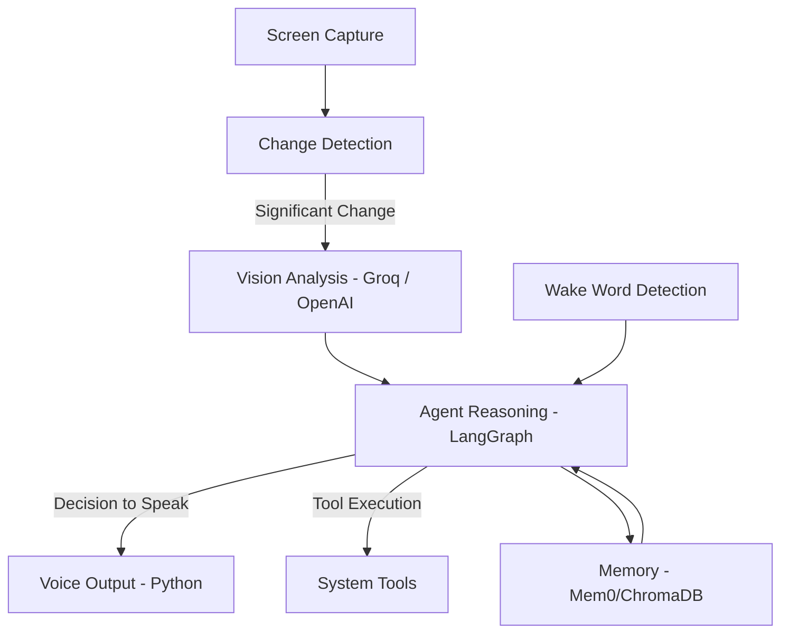

# Arg-1 - Argus

> A proactive, context-aware AI companion for your desktop environment.

Argus is an autonomous AI presence designed to monitor your workflow and provide intelligent, timely interventions. Unlike traditional reactive assistants, Argus analyzes your screen in real-time to understand your current context, goals, and patterns, offering assistance or insights precisely when they are most valuable.

---

## Core Philosophy

Argus is built on three pillars:
- **Proactivity**: It doesn't wait for a command. It initiates interaction based on your state—whether you're stuck on a technical challenge, drifting from a deadline, or have been idle for an extended period.
- **Contextual Intelligence**: By continuously observing your screen, Argus maintains a deep understanding of your current task, eliminating the need for manual explanations.
- **Efficiency & Privacy**: Local processing is prioritized to ensure minimal latency, low operational costs, and data sovereignty.

---

## Key Features

- **Continuous Vision Analysis**: Monitors screen activity through periodic captures and intelligent change detection.
- **Proactive Interventions**: Voice-based interruptions triggered by task-specific conditions (e.g., debugging assistance, focus reminders).
- **Adaptive User Profiling**: Dynamically builds and refines a persistent model of your work style, deadlines, and preferences.
- **Conversational Interface**: Natural voice interaction for follow-up questions and multi-modal task execution.
- **Integrated Tooling**: Autonomous execution of web searches, terminal commands, file operations, and document generation.
- **Session Memory**: Persistent context retention across restarts using vector-based memory systems.

---

## System Architecture

Argus utilizes a decoupled, multi-process architecture to balance real-time performance with sophisticated reasoning.



A Node.js core manages the heavy lifting of agent orchestration, screen processing, and tool execution, while a specialized Python service handles wake-word detection and high-fidelity voice synthesis. Communication occurs over a low-latency local TCP bridge (localhost:5001).

---

## Technical Stack

| Layer | Tool | Environment |
| :--- | :--- | :--- |
| **Orchestration** | LangGraph JS | Node.js |
| **Vision** | Groq / OpenAI Vision | API |
| **Screen Processing** | screenshot-desktop & Pixel Hashing | Node.js |
| **Context Extraction** | get-windows | Node.js |
| **Wake Word** | OpenWakeWord | Python |
| **Voice Synthesis** | edge-tts | Python |
| **Memory Architecture** | Mem0 + ChromaDB | Python |
| **IPC Bridge** | TCP Sockets (Localhost) | Multi-runtime |

---

## Performance & Cost Optimization

Argus is engineered for continuous operation with near-zero overhead:
- **Layered Triggers**: Vision API calls are only initiated after local pixel-diff and application-context checks confirm a noteworthy state change.
- **Local Sovereignty**: Wake-word detection, screen processing, and memory management are handled locally.
- **Provider Agnostic**: Easily switch between LLM providers (Groq, Anthropic, OpenAI, or local Ollama instances) via standard configuration.

---

## Development Roadmap

| Phase | Milestone | Status |
| :--- | :--- | :--- |
| **Phase 1** | Foundation: Screen capture, IPC bridge, and voice pipeline. | ✅ Complete |
| **Phase 2** | Intelligence: Vision-driven reasoning with LangGraph. | 🔨 In Progress |
| **Phase 3** | Integration: End-to-end proactive interruption cycles. | 📅 Upcoming |
| **Phase 4** | Capabilities: Core skill set (Web, Terminal, Files). | 📅 Upcoming |
| **Phase 5** | Persistence: Advanced long-term memory integration. | 📅 Upcoming |

---

## Getting Started

### Prerequisites

- Node.js 18.0+
- Python 3.10+
- `ffmpeg` (required for audio processing)
- A Groq or OpenAI API Key

### Installation

1. **Clone the repository:**
   ```bash
   git clone https://github.com/m-taqii/arg-1.git
   cd arg-1
   ```

2. **Setup Node.js environment:**
   ```bash
   npm install
   ```

3. **Setup Python environment:**
   ```bash
   python -m venv venv
   source venv/bin/activate  # Linux/macOS
   # OR
   .\venv\Scripts\activate   # Windows
   pip install -r requirements.txt
   ```

4. **Configuration:**
   ```bash
   cp .env.example .env
   # Edit .env with your API keys and preferred interval
   ```

### Execution

```bash
node core/index.js
```

Upon initial launch, Argus will conduct a brief initialization to calibrate your user profile. 

- **Voice Trigger**: "Hey Argus"
- **Sleep Command**: "Argus, rest now"

---

## Extending Argus: Skills System

Argus features a modular "Skills" architecture. New capabilities can be added by creating standalone JavaScript modules within the `skills/` directory. This allows for rapid extension of Argus's utility without modifying the core engine.

Refer to `skills/README.md` for the API specification and implementation guides.

---

## Contributing

Contributions are welcome. Given the dual-language architecture, developers can contribute to the Agent Brain (Node.js) or the Audio Pipeline (Python) independently. 

Please ensure all pull requests follow the established project structure and include descriptive documentation. For significant architectural changes, please open an issue for discussion first.

---

## License

Distributed under the MIT License. See `LICENSE` for more information.

---

<p align="center">
  <b>Developed by M.Taqi</b>
</p>