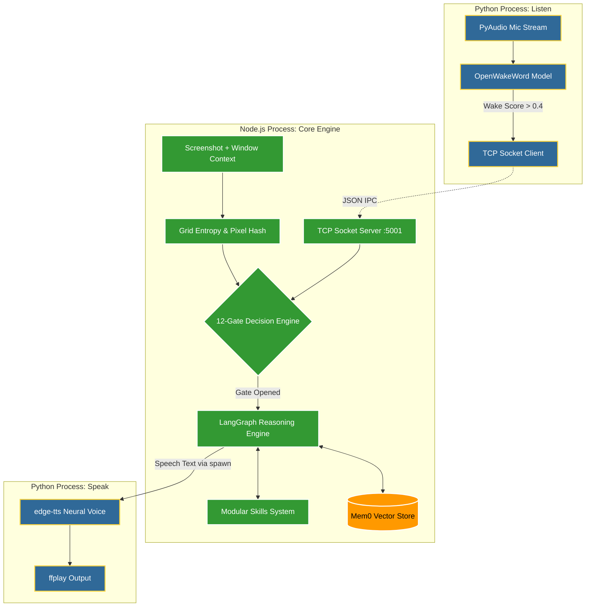

<h1 align="center">◈ Argus</h1>

<p align="center">
  <em>A proactive, screen-aware AI companion that watches your desktop and talks to you — not when you ask, but when it matters.</em>
</p>

---

Argus is an always-on desktop AI agent that observes your screen in real-time, understands what you're doing, and intervenes through voice — when you're stuck on a problem, spiraling through tabs, or drifting from a deadline. It doesn't wait to be asked. It watches, reasons, and decides when its input is worth breaking your concentration for.

A quiet presence that earns trust through restraint, not noise.

---

## Why Argus Exists

Most AI tools wait for you to tell them what's happening. Argus already knows — it's watching your screen. It sits in the background, analyzing your desktop state every few seconds, and uses a 12-gate heuristic engine to determine whether speaking up is worth the cost of breaking your flow.

Most of the time, the answer is silence. That's by design.

**What makes it different:**
- **No manual context** — Argus sees your screen. You never explain what you're working on.
- **Flow protection** — Detects sustained activity patterns and suppresses all interruptions to keep you in the zone.
- **Voice-first** — Speaks to you through neural TTS. No chat windows, no notification popups.
- **Zero-cost perception** — Local pixel hashing, grid-based entropy scoring, and OCR run before any API call is made. LLM reasoning is the last layer, not the first.
- **Works for anyone** — Whether you're writing code, designing, researching, or managing a project — Argus adapts to your workflow.

---

## System Architecture

Argus utilizes a decoupled, multi-process architecture to balance real-time performance with sophisticated reasoning.



A Node.js core manages the heavy lifting of agent orchestration, screen processing, and tool execution, while a specialized Python service handles wake-word detection and high-fidelity voice synthesis. Communication occurs over a low-latency local TCP bridge (`127.0.0.1:5001`).

---

## How It Works

### Layered Perception

Argus never sends your screen to an LLM raw. Every tick passes through a multi-layered perception pipeline that filters out noise before any API call is made:

| Layer | What It Does | Cost |
|:------|:-------------|:-----|
| **L1 — Pixel Hash** | SHA256 comparison of full screenshot. If identical to previous frame → skip everything. | Free |
| **L2 — Grid Entropy** | Downsamples to 64×32, slices into a 4×2 grid (8 cells). Calculates per-region diff scores (0.0–1.0) to detect *where* change happened. | Free |
| **L3 — 12-Gate Engine** | Heuristic decision system. Evaluates flow state, idle time, app context, spike patterns, and OCR signals to decide if LLM reasoning is justified. | Free |
| **L4 — Regional OCR** | Tesseract.js (WASM) scans bottom-row screen regions for error keywords when activity is detected there. | Free |
| **L5 — Vision LLM** | Multimodal reasoning via Groq/OpenAI. Only triggered when Gates 1–12 confirm intervention value. | Tokens |

Under normal use, **L5 fires a few times per hour**, not per tick.

### Cognitive Architecture

When the heuristic gates open, Argus invokes a **LangGraph** state machine. It uses **XML scoping** for maximum instruction fidelity. The LLM merges 4 temporal context layers:
1. **Identity** — User persona from `config/persona.json`
2. **Session** — Current session state
3. **Screen** — Live screenshot + app metadata
4. **Trigger** — Why this specific invocation happened (e.g. wake word, idle check-in, error detected)

The model reasons inside `<thinking>` tags before making any decisions, scoring the interruption priority, and ultimately producing a concise spoken response inside `<speech>` tags.

---

## Technical Stack

| Layer | Technology | Runtime |
|:------|:-----------|:--------|
| **Agent Orchestration** | LangGraph JS | Node.js |
| **Vision + Reasoning** | Groq (Llama-4-Scout) / OpenAI | API |
| **Local OCR** | Tesseract.js (WASM) | Node.js |
| **Screen Capture** | screenshot-desktop + Sharp | Node.js |
| **Context Extraction** | get-windows | Node.js |
| **Wake Word** | OpenWakeWord (ONNX) | Python |
| **Voice Synthesis** | edge-tts (Microsoft Neural) | Python |
| **Memory Architecture** | Mem0 + ChromaDB | Python |
| **IPC Bridge** | TCP Sockets (Localhost) | Both |

---

## Performance & Cost Profile

Argus is engineered for continuous operation with near-zero overhead:
- **Screen capture, pixel diff, grid entropy, OCR** → all local, all free.
- **Wake word detection** → runs locally via OpenWakeWord (ONNX).
- **Voice synthesis** → edge-tts (free, unofficial Microsoft Neural API).
- **LLM reasoning** → Groq free tier handles typical daily usage comfortably.
- **Provider Agnostic** → Swap Groq for OpenAI, Anthropic, or local Ollama via environment config.

---

## Development Roadmap

| Phase | Milestone | Status |
|:------|:----------|:-------|
| **Phase 1** | Foundation: Screen capture, TCP IPC bridge, and voice pipeline. | ✅ Complete |
| **Phase 2** | Intelligence: Vision-driven reasoning with LangGraph. | ✅ Complete |
| **Phase 3** | Decision Engine: 12-gate heuristic intelligence. | ✅ Complete |
| **Phase 4** | Integration: End-to-end proactive interruption cycles. | ✅ Complete |
| **Phase 5** | Capabilities: Modular tool execution (Skills) system. | ✅ Complete |
| **Phase 6** | Persistence: Advanced long-term memory integration (Mem0). | 📅 Upcoming |
| **Phase 7** | Conversation: Wake word → speech-to-text dialogue loop. | 📅 Upcoming |
| **Phase 8** | Custom Wake Word: Trained "Hey Argus" model. | 📅 Upcoming |

---

## Getting Started

### Prerequisites

- Node.js 18.0+ (with pnpm)
- Python 3.10+
- `ffmpeg` (required for audio processing/playback)
- A Groq, Google, or OpenAI API Key

### Installation

```bash
# Clone
git clone https://github.com/m-taqii/argus.git
cd argus

# Node.js dependencies
pnpm install

# Python virtual environment
python -m venv venv
# Linux/macOS
source venv/bin/activate
# Windows
.\venv\Scripts\activate
pip install -r requirements.txt

# Configuration
cp .env.sample .env
# Edit .env with your API keys and preferred interval
```

### Execution

```bash
pnpm start
```

Upon initial launch, Argus will conduct a brief initialization to calibrate your user profile. 

- **Voice Trigger**: "Hey Jarvis" (placeholder for "Hey Argus")
- **Sleep Command**: "Argus, rest now"

---

## Extending Argus: Skills System

Argus features a modular "Skills" architecture. New capabilities can be added by creating standalone JavaScript or Python modules within the `skills/` directory. This allows for rapid extension of Argus's utility without modifying the core engine.

Each skill requires a `skill.md` file describing its purpose, which the LangGraph agent reads to understand when to invoke it via the `execute_skill` tool.

---

## Contributing

Contributions are welcome. Given the dual-language architecture, developers can contribute to the Agent Brain (Node.js) or the Audio Pipeline (Python) independently. 

Please ensure all pull requests follow the established project structure and include descriptive documentation. For significant architectural changes, open an issue for discussion first.

---

## License

Distributed under the MIT License. See `LICENSE` for more information.

---

<p align="center">
  <sub>Named after the Greek giant with a hundred eyes who never sleeps.</sub><br/>
  <b>Built with ❤️ by <a href="https://github.com/m-taqii">M.Taqi</a></b>
</p>